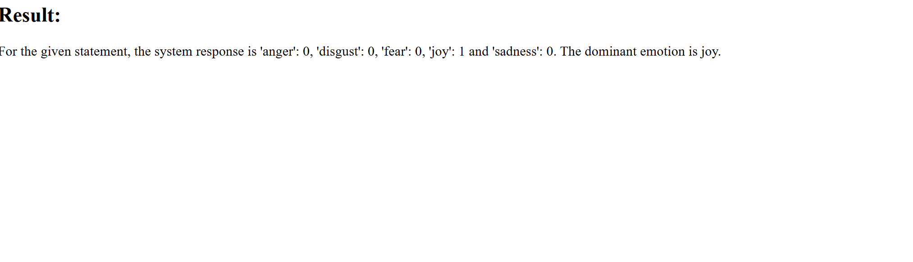
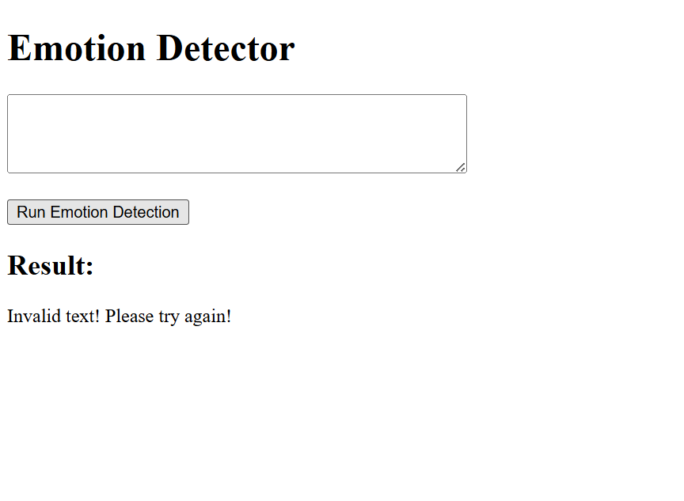

# Emotion Detector


A small web application that reads a sentence and tells you the emotion behind it. You type
some text, the app sends it to IBM Watson NLP's **EmotionPredict** service, scores it across
five emotions — anger, disgust, fear, joy, and sadness — and reports back both the individual
scores and the single dominant emotion.

It was built as the capstone project for IBM's *Developing AI Applications with Python and
Flask* course (part of the IBM AI Engineering Professional Certificate on Coursera), but it's
structured as a real, self-contained app: a reusable detection package, a Flask front end, a
unit-test suite, and a graceful offline fallback for when the Watson endpoint can't be reached.

---

## Table of Contents

- [What I Built](#what-i-built)
- [Tech Stack](#tech-stack)
- [Project Structure](#project-structure)
- [Setup & Installation](#setup--installation)
- [Usage](#usage)
- [API Reference](#api-reference)
- [Testing](#testing)
- [Screenshots](#screenshots)
- [What I Learned](#what-i-learned)
- [License](#license)

---

## What I Built

The heart of the project is the `EmotionDetection` package and its `emotion_detector()`
function. The end-to-end flow is:

1. **User input** — the browser sends the text to analyze to the Flask backend as a query
   parameter (`textToAnalyze`).
2. **Watson NLP API call** — `emotion_detector()` sends a `POST` request to Watson NLP's
   EmotionPredict endpoint, with the text wrapped in a `raw_document` payload and the model
   selected via the `grpc-metadata-mm-model-id` header.
3. **JSON parsing** — the response is parsed and the emotion object is pulled out of
   `emotionPredictions[0]["emotion"]`.
4. **Emotion scoring** — the five scores (`anger`, `disgust`, `fear`, `joy`, `sadness`) are
   collected into a dictionary.
5. **Dominant emotion resolution** — the label with the highest score is selected with
   `max(scores, key=scores.get)` and returned as `dominant_emotion`.
6. **Formatted response** — the Flask route turns that dictionary into a readable sentence and
   sends it back to the page.

### Error handling

Blank and invalid input is handled deliberately, in more than one place:

- **Empty / falsy input** short-circuits *before* any network call — the function immediately
  returns a dictionary with every score (and the dominant emotion) set to `None`.
- **HTTP 400 from Watson** (which the API returns for blank text) is caught and mapped to the
  same all-`None` dictionary.
- The Flask route checks for `dominant_emotion is None` and responds with
  `"Invalid text! Please try again!"` instead of a score line.

### Offline fallback

If the Watson endpoint is unreachable (a network error / `requests.exceptions.RequestException`),
the code doesn't crash — it falls back to a local keyword-based `local_emotion_detector()` that
returns a best-effort emotion. This keeps the app and the test suite functional even without
access to the hosted Watson service.

---

## Tech Stack

| Layer            | Technology                                             |
| ---------------- | ------------------------------------------------------ |
| Language         | Python 3.12                                            |
| Web framework    | Flask                                                  |
| HTTP client      | `requests`                                             |
| Emotion analysis | IBM Watson NLP — EmotionPredict API                    |
| Front end        | HTML + vanilla JavaScript (`XMLHttpRequest`)           |
| Testing          | `unittest` (Python standard library)                   |

---

## Project Structure

```
EmotionDetection/
├── EmotionDetection/           # The emotion-detection package
│   ├── __init__.py             # Exposes emotion_detector()
│   └── emotion_detection.py    # Watson NLP call, parsing, scoring, fallback
├── static/
│   └── mywebscript.js          # Front-end request logic
├── templates/
│   └── index.html              # Web interface
├── server.py                   # Flask app and routes
├── test_emotion_detection.py   # unittest suite
├── requirements.txt            # Python dependencies
├── flask_deployment_demo.png   # Screenshot: working detection
├── error_handling_demo.png     # Screenshot: blank-input handling
├── LICENSE
└── README.md
```

---

## Setup & Installation

**Prerequisites:** Python 3.12 (any recent 3.x should work).

```bash
# 1. Clone the repository
git clone <your-repo-url>
cd EmotionDetection

# 2. (Recommended) create and activate a virtual environment
python -m venv venv
source venv/bin/activate        # Windows: venv\Scripts\activate

# 3. Install dependencies
pip install -r requirements.txt

# 4. Run the Flask server
python server.py
```

The server starts on **http://localhost:5000**. Open that address in a browser to use the app.

> **Note on Watson access:** the EmotionPredict endpoint used here is the hosted instance
> provided by the course lab environment. Outside that environment the request may time out —
> in that case the app automatically uses its local fallback detector, so it keeps working.

---

## Usage

1. Start the server (`python server.py`) and open **http://localhost:5000**.
2. Type a sentence into the text box, e.g. *"I am glad this happened."*
3. Click **Run Emotion Detection**.

Example output rendered on the page:

```
For the given statement, the system response is 'anger': 0.006, 'disgust': 0.002,
'fear': 0.009, 'joy': 0.968 and 'sadness': 0.049. The dominant emotion is joy.
```

For blank or invalid input the page shows:

```
Invalid text! Please try again!
```

---

## API Reference

### `GET /`

Serves the web interface (`index.html`).

### `GET /emotionDetector`

Runs emotion detection on a piece of text.

| Parameter       | In    | Type   | Description                         |
| --------------- | ----- | ------ | ----------------------------------- |
| `textToAnalyze` | query | string | The text to analyze for emotion.    |

**Response:** `text/plain`. On success, a formatted sentence containing each score and the
dominant emotion:

```
For the given statement, the system response is 'anger': 0.006, 'disgust': 0.002,
'fear': 0.009, 'joy': 0.968 and 'sadness': 0.049. The dominant emotion is joy.
```

On blank / invalid input:

```
Invalid text! Please try again!
```

**Underlying data shape.** The Flask route builds its sentence from the dictionary returned by
`emotion_detector()`, which uses these exact keys:

```python
{
    "anger": 0.006,
    "disgust": 0.002,
    "fear": 0.009,
    "joy": 0.968,
    "sadness": 0.049,
    "dominant_emotion": "joy"
}
```

For blank/invalid input every value in that dictionary is `None`.

---

## Testing

The suite uses Python's built-in `unittest` and checks that a representative sentence for each
emotion resolves to the correct `dominant_emotion` (joy, anger, disgust, sadness, fear).

```bash
python -m unittest test_emotion_detection -v
```

Expected result: **5 tests, all passing.**

---

## Screenshots

| Working detection | Error handling |
| :---: | :---: |
|  |  |
| The app returning per-emotion scores and the resolved dominant emotion for a valid sentence. | The interface responding with *"Invalid text! Please try again!"* when the input is blank. |

---

## What I Learned

- **Integrating an external REST API end to end** — constructing an authenticated `POST`
  request to Watson NLP (custom headers, `raw_document` payload) and parsing a nested JSON
  response down to `emotionPredictions[0]["emotion"]`.
- **Defensive error handling around a service you don't control** — distinguishing three
  distinct failure modes (empty input, an HTTP 400 from the API, and a network exception) and
  giving each a sensible, non-crashing outcome, including a local fallback detector.
- **Packaging and serving Python** — organizing the logic into an importable package and wiring
  it into a Flask app with a query-parameter route and a small JavaScript front end.
- **Writing deterministic unit tests** — using `unittest` to lock down the dominant-emotion
  behavior for each category so the core logic can be refactored with confidence.

---

## License

This project is licensed under the **Apache License 2.0** — see the [LICENSE](LICENSE) file for
the full text.
